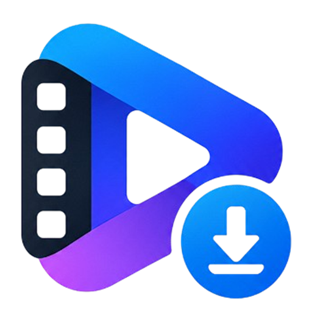
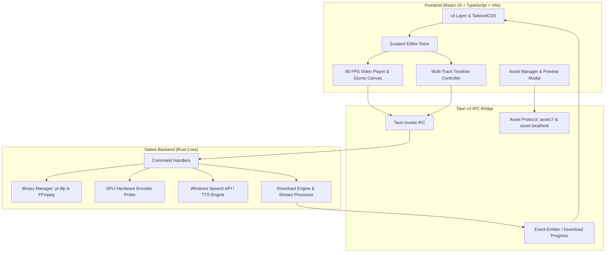

<div align="center">

  

  # Filmov — Video Editor & Social Downloader

  **Hardware-Accelerated Professional Video Editor & Multi-Platform Social Media Downloader**

  [](https://tauri.app/)
  [](https://www.rust-lang.org/)
  [](https://react.dev/)
  [](https://www.typescriptlang.org/)
  [](https://vitejs.dev/)
  [](https://github.com/)
  [](LICENSE)

  <p align="center">
    <a href="#features">Features</a> •
    <a href="#architecture--tech-stack">Architecture</a> •
    <a href="#installation--running">Installation</a> •
    <a href="#building-installers">Build Installer</a> •
    <a href="#project-structure">Project Structure</a> •
    <a href="#keyboard-shortcuts">Shortcuts</a> •
    <a href="#troubleshooting--faq">FAQ</a>
  </p>

  <p><b>📄 <a href="README.md">Bahasa Indonesia</a></b></p>

</div>

---

## 📖 About Filmov

**Filmov** is a modern desktop application that combines a **high-precision multi-track Video Editor** with a **high-speed Social Media Downloader & MP3 Converter**.

Built on a hybrid architecture using **Tauri v2** and **Rust** on the backend with **React 19** + **TailwindCSS** on the frontend, Filmov delivers extremely lightweight native performance, minimal memory usage, and full acceleration through GPU hardware encoders.

---

## 🌟 Key Features

### 1. ⚡ GPU Hardware Acceleration (Export Engine)
- **Automatic GPU encoder detection:**
  - 🟢 **NVIDIA NVENC** (`h264_nvenc`, `hevc_nvenc`)
  - 🔵 **Intel QuickSync Video (QSV)** (`h264_qsv`)
  - 🔴 **AMD AMF** (`h264_amf`)
  - ⚪ **Apple Silicon VideoToolbox** (`h264_videotoolbox`)
  - ⚙️ **Multi-threaded CPU fallback** (`libx264` / `libvpx-vp9`)
- Multi-resolution export: **4K UHD (2160p)**, **Full HD (1080p)**, **HD (720p)**, and **MP3 audio**.
- Bitrate control (CBR/VBR), speed presets (*Ultra-fast, Balanced, Best Quality*), and audio sample rate (44.1 kHz / 48 kHz).

### 2. 🎬 Multi-Track Timeline & Precision 60 FPS Canvas
- **Multi-track editing:**
  - Video tracks (`V1, V2, ...`) with blending and overlay support.
  - Audio tracks (`A1, A2, ...`) with waveform preview and volume/mute synchronisation.
  - Subtitle tracks (`Sub`) for dynamic text and automatic captions.
- **On-canvas interactive transform gizmo:** move X/Y position, scale, and rotate video/images directly on the preview canvas.
- **Transitions & keyframing:** Fade, Dissolve, Wipe Left/Right, Slide Up/Down, Circle Crop, and Zoom transitions.
- **Color grading & filters:** real-time Brightness, Contrast, Saturation, Temperature, Tint, and Exposure.
- **Aspect ratio switcher:**
  - `16:9` (YouTube / Landscape)
  - `9:16` (TikTok / Instagram Reels / YouTube Shorts)
  - `1:1` (Instagram Square Post)
  - `4:5` (Social Portrait)
  - `21:9` (Cinematic Ultrawide)

### 3. 📥 Integrated Social Downloader & MP3 Converter
- Powered by the `yt-dlp` and `ffmpeg` engines.
- Compatible with **YouTube** (including music videos & Shorts), **Instagram Reels/Posts**, **X (Twitter)**, and **TikTok**.
- **Special features:**
  - **HD / 4K video download:** downloads video with the audio automatically and perfectly merged.
  - **Convert to MP3:** converts online video into high-quality MP3 audio (320 kbps).
  - **Native Save-As dialog:** save a downloaded file or MP3 to any local folder via the Windows Explorer dialog.
  - **Send to Timeline:** place a freshly downloaded video or MP3 straight onto a timeline track in one click.

### 4. 🎙️ AI Voice & Audio Studio
- **Auto-Captions (Whisper Subtitles):** automatic per-second synchronised transcription of audio into subtitle text.
- **Quick script presets (Indonesian):**
  - 🎬 *Content / Creator Intro*
  - 📖 *Tutorial & Guide*
  - 🌄 *Cinematic Narration*
  - 📣 *Promotion & Outro*
- **Neural Text-to-Speech (TTS):** generate natural voiceovers (Indonesian & English) using the native Windows Speech API (SAPI) / Web Speech and save them automatically to `.wav`.
- **Audio DSP enhancer:** Noise Reduction slider, Voice Isolation, and Vocal Clarity Boost.

---

## 🏗️ Architecture & Tech Stack



### Tech Stack

| Component | Technology | Description |
| :--- | :--- | :--- |
| **Native Framework** | [Tauri v2](https://v2.tauri.app/) | Ultra-lightweight, sandboxed desktop app runtime |
| **Backend Core** | [Rust](https://www.rust-lang.org/) | File processing, GPU hardware probing, SAPI TTS, and process execution |
| **Frontend UI** | [React 19](https://react.dev/) | Modern component-based UI library |
| **Language** | [TypeScript 5](https://www.typescriptlang.org/) | Static typing for reliable frontend code |
| **State Management** | [Zustand](https://zustand.docs.pmnd.rs/) | Timeline, track, clip, and Undo/Redo history state |
| **Styling** | [TailwindCSS v4](https://tailwindcss.com/) | Modern utility styling with light/dark themes |
| **Icon Pack** | [Lucide React](https://lucide.dev/) | Enterprise-grade SVG icon set |
| **Media Engine** | `yt-dlp` & `FFmpeg` | Social stream downloading, media extraction, and format conversion |

---

## 💻 Installation & Running

### System Prerequisites
1. **Node.js:** `v18.0.0` or newer (Node.js v20 LTS recommended).
2. **Rust & Cargo:** Version `1.75+` ([Install via rustup](https://rustup.rs/)).
3. **C++ Build Tools:** Visual Studio Build Tools (C++) for Windows.
4. **yt-dlp & FFmpeg:** **Already bundled** in `src-tauri/binaries/` and shipped with the installer — no manual install required. Use the **Install Engines / Update yt-dlp** button in Settings to pull the latest version.

### 1. Clone the Repository
```bash
git clone https://github.com/99apps-id/filmov-studio.git
cd filmov
```

### 2. Install Node.js Dependencies
```bash
npm install
```

### 3. Run Desktop Development Mode (Tauri)
```bash
npm run tauri dev
```

### 4. Run Web Browser Mode Only (Preview)
```bash
npm run dev
```

---

## 📦 Building Installers

Filmov supports creating native Windows installer packages in **NSIS (.exe)** and **WiX (.msi)** formats.

### Build Windows Installers (NSIS & MSI)
```bash
npm run tauri build -- --bundles nsis,msi
```

Installer output files are generated in the following folders:
- **NSIS Setup (.exe):** `src-tauri/target/release/bundle/nsis/Filmov_0.1.0_x64-setup.exe`
- **WiX Installer (.msi):** `src-tauri/target/release/bundle/msi/Filmov_0.1.0_x64_en-US.msi`

> **Engine bundle note.** The installer ships `yt-dlp` + `ffmpeg`/`ffprobe` (via `bundle.resources`) so the app can download YouTube/IG/X and convert to MP3 out of the box, fully offline. This makes the installer larger (±213 MB). These third-party binaries are subject to their own licenses — see `src-tauri/binaries/THIRD-PARTY-LICENSES.md` (FFmpeg GPLv3, yt-dlp Unlicense).

### Build Standalone Binary (.exe)
```bash
npm run tauri build
```
Self-contained executable: `src-tauri/target/release/filmov.exe`

---

## 📂 Project Structure

```text
filmov/
├── public/                       # Public assets, icons, and sample media
│   ├── logo_square.png           # Master application icon
│   ├── logo.png                  # Transparent Filmov logo
│   ├── sample-video.mp4          # Offline sample video
│   └── sample-audio.mp3          # Offline sample audio
├── src/                          # Frontend React source
│   ├── components/
│   │   ├── downloader/           # Social Downloader (YouTube/IG/X/TikTok)
│   │   ├── export/               # Export Modal & GPU Engine Selector
│   │   ├── inspector/            # Transform, Transition & Color Grading Panel
│   │   ├── layout/               # Header, Sidebar, and Window Chrome
│   │   ├── media/                # Media Pool, Asset Import & Quick Preview
│   │   ├── player/               # 60 FPS Canvas Player & Transform Gizmo
│   │   ├── settings/             # Settings Modal & Hardware Status
│   │   ├── timeline/             # Multi-Track Timeline, Track Items & Playhead
│   │   └── voice/                # AI Voice Studio (Auto Captions & TTS)
│   ├── store/                    # Zustand Stores (useEditorStore, useDownloaderStore)
│   ├── types/                    # TypeScript data interfaces & models
│   ├── utils/                    # Media protocols, formatters, and asset URL helpers
│   ├── App.tsx                   # Main root component & routing
│   └── main.tsx                  # Vite React entrypoint
├── src-tauri/                    # Native Rust backend (Tauri v2)
│   ├── icons/                    # Multi-resolution icon bundle (.ico, .icns, .png)
│   ├── src/
│   │   ├── commands/
│   │   │   ├── binary_manager.rs # FFmpeg/yt-dlp detection & resolver, install_engines
│   │   │   ├── downloader.rs     # Download IPC commands, Convert MP3 & Save-As
│   │   │   ├── video.rs          # Asset protocol, probing, waveform & GPU export
│   │   │   ├── project.rs        # Save/Load project (path-traversal guard)
│   │   │   └── voice.rs          # SAPI speech synthesis & Whisper transcription
│   ├── binaries/                 # Bundled engines: ffmpeg/ffprobe/yt-dlp (.exe) + licenses
│   │   ├── lib.rs                # Tauri plugin registration & IPC routing
│   │   └── main.rs               # Rust binary entrypoint
│   ├── Cargo.toml                # Rust dependencies & build configuration
│   ├── build.rs                  # Windows resource & PE embedding
│   └── tauri.conf.json           # Tauri v2 config (window, security, bundle)
├── package.json                  # Node.js NPM scripts & dependencies
├── tsconfig.json                 # TypeScript compiler config
└── vite.config.ts                # Vite bundler config
```

---

## ⌨️ Keyboard Shortcuts

| Shortcut | Action |
| :--- | :--- |
| <kbd>Space</kbd> | Play / Pause transport player |
| <kbd>←</kbd> (Left Arrow) | Step back 1 frame |
| <kbd>→</kbd> (Right Arrow) | Step forward 1 frame |
| <kbd>Ctrl</kbd> + <kbd>Z</kbd> | Undo timeline change |
| <kbd>Ctrl</kbd> + <kbd>Y</kbd> / <kbd>Ctrl</kbd> + <kbd>Shift</kbd> + <kbd>Z</kbd> | Redo timeline change |
| <kbd>Delete</kbd> / <kbd>Backspace</kbd> | Delete the selected clip |
| <kbd>S</kbd> | Split / cut clip at playhead position |
| <kbd>Ctrl</kbd> + <kbd>E</kbd> | Open video export dialog |
| <kbd>F11</kbd> | Toggle canvas fullscreen |

---

## ❓ Troubleshooting & FAQ

<details>
<summary><b>1. YouTube video returns "HTTP 403 Forbidden" when downloading?</b></summary>
<br>
Make sure you are using the latest build. Filmov integrates the <code>--extractor-args "youtube:player_client=android"</code> option, which automatically bypasses YouTube's streaming restrictions to download video and audio optimally.
</details>

<details>
<summary><b>2. Why can't local files play on the timeline (Asset Protocol 403)?</b></summary>
<br>
Tauri v2 enforces a strict security model on the file protocol. Filmov restricts access to standard user-content directories only (<code>$VIDEO</code>, <code>$DOWNLOAD</code>, <code>$AUDIO</code>, <code>$DOCUMENT</code>, <code>$DESKTOP</code>, <code>$TEMP</code>, <code>$RESOURCE</code>) — <b>without</b> access to <code>C:\</code>, home/AppData, or <code>**</code>. When you import a file, access is granted only for that specific file (non-recursively).
</details>

<details>
<summary><b>3. How do I save converted audio as MP3?</b></summary>
<br>
After a download finishes in the <b>Social Downloader</b>, click the <b>"Save As"</b> button on the queue item. A Windows dialog appears pre-filtered to <code>MP3 Audio (*.mp3)</code> so you can pick any storage folder on your computer.
</details>

<details>
<summary><b>4. Can Filmov be used entirely offline?</b></summary>
<br>
<b>Yes.</b> All timeline editing, color grading, canvas transform, video playback, and AI Text-to-Speech (SAPI) run 100% locally on your computer without an internet connection.
</details>

---

## 📄 License

This project is distributed under the **MIT License**. See the [LICENSE](LICENSE) file for more information.

---

<div align="center">
  <sub>Built with ❤️ by the Filmov Team using Tauri v2 & Rust.</sub>
</div>
