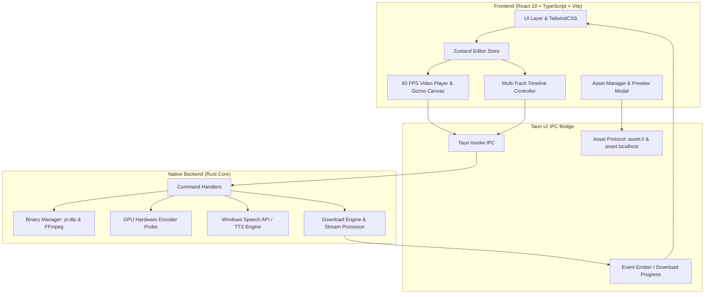

<div align="center">

  

  # Filmov — Video Editor & Social Downloader

  **Hardware-Accelerated Professional Video Editor & Multi-Platform Social Media Downloader**

  [](https://tauri.app/)
  [](https://www.rust-lang.org/)
  [](https://react.dev/)
  [](https://www.typescriptlang.org/)
  [](https://vitejs.dev/)
  [](https://github.com/)
  [](LICENSE)

  <p align="center">
    <a href="#-fitur-utama">Fitur Utama</a> •
    <a href="#-arsitektur--teknologi">Arsitektur</a> •
    <a href="#-panduan-instalasi">Instalasi</a> •
    <a href="#-kompilasi--build-installer">Build Installer</a> •
    <a href="#-struktur-proyek">Struktur Proyek</a> •
    <a href="#-keyboard-shortcuts">Shortcuts</a> •
    <a href="#-troubleshooting--faq">FAQ</a>
  </p>

</div>

---

## 📖 Tentang Filmov

**Filmov** adalah aplikasi desktop modern yang menggabungkan kemampuan **Video Editor multi-track presisi tinggi** dengan **Social Media Downloader & MP3 Converter** berkecapatan tinggi. 

Dibangun dengan arsitektur hybrid menggunakan **Tauri v2** dan **Rust** di sisi backend serta **React 19** + **TailwindCSS** di sisi frontend, Filmov menghadirkan performa native yang sangat ringan, penggunaan memori minimal, dan akselerasi penuh melalui GPU hardware encoders.

---

## 🌟 Fitur Utama

### 1. ⚡ Akselerasi Hardware GPU (Export Engine)
- **Deteksi Otomatis Enkoder GPU:**
  - 🟢 **NVIDIA NVENC** (`h264_nvenc`, `hevc_nvenc`)
  - 🔵 **Intel QuickSync Video (QSV)** (`h264_qsv`)
  - 🔴 **AMD AMF** (`h264_amf`)
  - ⚪ **Apple Silicon VideoToolbox** (`h264_videotoolbox`)
  - ⚙️ **CPU Fallback Multi-Threaded** (`libx264` / `libvpx-vp9`)
- Ekspor multi-resolusi: **4K UHD (2160p)**, **Full HD (1080p)**, **HD (720p)**, dan **Audio MP3**.
- Pengaturan Bitrate (CBR/VBR), Preset Kecepatan (*Ultra-fast, Balanced, Best Quality*), dan Audio Sample Rate (44.1 kHz / 48 kHz).

### 2. 🎬 Timeline Multi-Track & Canvas Presisi 60 FPS
- **Multi-Track Editing:**
  - Track Video (`V1, V2, ...`) dengan dukungan blending dan overlay.
  - Track Audio (`A1, A2, ...`) dengan waveform preview dan sinkronisasi volume/mute.
  - Track Subtitle (`Sub`) untuk teks dinamis dan caption otomatis.
- **On-Canvas Interactive Transform Gizmo:** Geser posisi X/Y, scale, dan rotasi video/gambar langsung di atas canvas preview.
- **Transisi & Keyframing:** Fade, Dissolve, Wipe Left/Right, Slide Up/Down, Circle Crop, dan Zoom Transition.
- **Color Grading & Filters:** Pengaturan Brightness, Contrast, Saturation, Temperature, Tint, dan Exposure secara real-time.
- **Aspect Ratio Switcher:**
  - `16:9` (YouTube / Landscape)
  - `9:16` (TikTok / Instagram Reels / YouTube Shorts)
  - `1:1` (Instagram Square Post)
  - `4:5` (Social Portrait)
  - `21:9` (Cinematic Ultrawide)

### 3. 📥 Social Downloader & MP3 Converter Terintegrasi
- Didukung oleh mesin `yt-dlp` dan `ffmpeg`.
- Kompatibel dengan **YouTube** (termasuk video musik & shorts), **Instagram Reels/Posts**, **X (Twitter)**, dan **TikTok**.
- **Fitur Khusus:**
  - **Download Video HD / 4K**: Mengunduh video dengan audio yang otomatis tergabung sempurna.
  - **Convert to MP3**: Mengonversi video online menjadi audio MP3 (320 kbps) berkualitas tinggi.
  - **Save As Native Dialog**: Menyimpan file unduhan atau MP3 ke folder lokal mana pun melalui dialog Windows Explorer.
  - **Send to Timeline**: Menempatkan video atau MP3 yang baru diunduh langsung ke track timeline dalam satu klik.

### 4. 🎙️ AI Voice & Audio Studio
- **Auto-Captions (Whisper Subtitles):** Transkripsi otomatis audio menjadi teks subtitle tersinkronisasi per detik.
- **Preset Naskah Cepat Bahasa Indonesia:**
  - 🎬 *Intro Konten / Creator*
  - 📖 *Tutorial & Panduan*
  - 🌄 *Narasi Sinematik*
  - 📣 *Promosi & Penutup*
- **Neural Text-to-Speech (TTS):** Menghasilkan sulih suara alami (Bahasa Indonesia & Bahasa Inggris) menggunakan native Windows Speech API (SAPI) / Web Speech dan otomatis menyimpannya ke format `.wav`.
- **Audio DSP Enhancer:** Noise Reduction slider, Voice Isolation, dan Vocal Clarity Boost.

---

## 🏗️ Arsitektur & Teknologi



### Tech Stack

| Komponen | Teknologi | Deskripsi |
| :--- | :--- | :--- |
| **Framework Native** | [Tauri v2](https://v2.tauri.app/) | Runtime aplikasi desktop ultra-ringan dengan keamanan sandbox |
| **Backend Core** | [Rust](https://www.rust-lang.org/) | Pemrosesan file, probe hardware GPU, SAPI TTS, dan eksekusi proses |
| **Frontend UI** | [React 19](https://react.dev/) | Library antarmuka berbasis komponen modern |
| **Bahasa Pemrograman** | [TypeScript 5](https://www.typescriptlang.org/) | Static typing untuk keandalan kode frontend |
| **State Management** | [Zustand](https://zustand.docs.pmnd.rs/) | Manajemen state timeline, track, klip, dan riwayat Undo/Redo |
| **Styling** | [TailwindCSS v4](https://tailwindcss.com/) | Utilitas styling modern dengan tema gelap/terang |
| **Icon Pack** | [Lucide React](https://lucide.dev/) | Set ikon SVG visual kelas enterprise |
| **Mesin Media** | `yt-dlp` & `FFmpeg` | Pengunduhan stream sosial, ekstraksi media, dan konversi format |

---

## 💻 Panduan Instalasi & Menjalankan

### Prasyarat Sistem
1. **Node.js**: `v18.0.0` atau lebih baru (disarankan Node.js v20 LTS).
2. **Rust & Cargo**: Versi `1.75+` ([Install Rust via rustup](https://rustup.rs/)).
3. **C++ Build Tools**: Visual Studio Build Tools (C++) untuk Windows.
4. **yt-dlp & FFmpeg**: **Sudah dibundel** di `src-tauri/binaries/` dan ikut terbawa installer — tidak perlu instal manual. Gunakan tombol **Install Engines / Update yt-dlp** di menu Settings untuk menarik versi terbaru.

### 1. Clone Repository
```bash
git clone https://github.com/username/filmov.git
cd filmov
```

### 2. Install Dependency Node.js
```bash
npm install
```

### 3. Jalankan Mode Development Desktop (Tauri)
```bash
npm run tauri dev
```

### 4. Jalankan Mode Web Browser Saja (Preview)
```bash
npm run dev
```

---

## 📦 Kompilasi & Build Installer

Filmov mendukung pembuatan paket installer native Windows dalam format **NSIS (.exe)** dan **WiX (.msi)**.

### Build Installer Windows (NSIS & MSI)
```bash
npm run tauri build -- --bundles nsis,msi
```

File output installer akan dihasilkan pada folder berikut:
- **NSIS Setup (.exe):** `src-tauri/target/release/bundle/nsis/Filmov_0.1.0_x64-setup.exe`
- **WiX Installer (.msi):** `src-tauri/target/release/bundle/msi/Filmov_0.1.0_x64_en-US.msi`

> **Catatan bundle engine.** Installer menyertakan `yt-dlp` + `ffmpeg`/`ffprobe` (via `bundle.resources`) sehingga aplikasi langsung bisa mengunduh YouTube/IG/X dan mengonversi ke MP3 secara offline. Hal ini membuat ukuran installer lebih besar (±213 MB). Binari pihak ketiga ini tunduk pada lisensinya masing-masing — lihat `src-tauri/binaries/THIRD-PARTY-LICENSES.md` (FFmpeg GPLv3, yt-dlp Unlicense).

### Build Binary Standalone (.exe)
```bash
npm run tauri build
```
File executable mandiri: `src-tauri/target/release/filmov.exe`

---

## 📂 Struktur Proyek

```text
filmov/
├── public/                       # Aset publik, ikon, dan sampel media
│   ├── app-icon-512.png          # Master icon aplikasi
│   ├── logo.png                  # Logo transparan Filmov
│   ├── sample-video.mp4          # Sampel video offline
│   └── sample-audio.mp3          # Sampel audio offline
├── src/                          # Frontend React Source Code
│   ├── components/
│   │   ├── downloader/           # Social Downloader (YouTube/IG/X/TikTok)
│   │   ├── export/               # Export Modal & GPU Engine Selector
│   │   ├── inspector/            # Transform, Transition & Color Grading Panel
│   │   ├── layout/               # Header, Sidebar, dan Window Chrome
│   │   ├── media/                # Media Pool, Asset Import & Quick Preview
│   │   ├── player/               # 60 FPS Canvas Player & Transform Gizmo
│   │   ├── settings/             # Settings Modal & Hardware Status
│   │   ├── timeline/             # Multi-Track Timeline, Track Items & Playhead
│   │   └── voice/                # AI Voice Studio (Auto Captions & TTS)
│   ├── store/                    # Zustand Stores (useEditorStore, useDownloaderStore)
│   ├── types/                    # TypeScript Data Interfaces & Models
│   ├── utils/                    # Helper Media Protocols, Formatters & Asset URLs
│   ├── App.tsx                   # Main Root Component & Routing
│   └── main.tsx                  # Vite React Entrypoint
├── src-tauri/                    # Native Rust Backend (Tauri v2)
│   ├── icons/                    # Multi-resolusi Icon Bundle (.ico, .icns, .png)
│   ├── src/
│   │   ├── commands/
│   │   │   ├── binary_manager.rs # Deteksi & Resolver FFmpeg/yt-dlp, install_engines
│   │   │   ├── downloader.rs     # IPC Command Pengunduhan, Convert MP3 & Save-As
│   │   │   ├── video.rs          # Asset Protocol, Probing, Waveform & Export GPU
│   │   │   ├── project.rs        # Save/Load Project (path-traversal guard)
│   │   │   └── voice.rs          # SAPI Speech Synthesis & Whisper Transcription
│   ├── binaries/                 # Engine ter-bundle: ffmpeg/ffprobe/yt-dlp (.exe) + lisensi
│   ├── icons/                    # Multi-resolusi Icon Bundle (.ico, .icns, .png)
│   │   ├── lib.rs                # Tauri Plugin Registration & IPC Routing
│   │   └── main.rs               # Rust Binary Entrypoint
│   ├── Cargo.toml                # Rust Dependencies & Build Config
│   ├── build.rs                  # Windows Resource & PE Embedding
│   └── tauri.conf.json           # Konfigurasi Tauri v2 (Window, Security, Bundle)
├── package.json                  # Node.js NPM Scripts & Dependencies
├── tsconfig.json                 # TypeScript Compiler Config
└── vite.config.ts                # Vite Bundler Config
```

---

## ⌨️ Keyboard Shortcuts

| Shortcut | Aksi |
| :--- | :--- |
| <kbd>Space</kbd> | Play / Pause Transport Player |
| <kbd>←</kbd> (Left Arrow) | Step Mundur 1 Frame |
| <kbd>→</kbd> (Right Arrow) | Step Maju 1 Frame |
| <kbd>Ctrl</kbd> + <kbd>Z</kbd> | Undo Perubahan Timeline |
| <kbd>Ctrl</kbd> + <kbd>Y</kbd> / <kbd>Ctrl</kbd> + <kbd>Shift</kbd> + <kbd>Z</kbd> | Redo Perubahan Timeline |
| <kbd>Delete</kbd> / <kbd>Backspace</kbd> | Hapus Klip yang Dipilih |
| <kbd>S</kbd> | Split / Potong Klip di Posisi Playhead |
| <kbd>Ctrl</kbd> + <kbd>E</kbd> | Buka Dialog Ekspor Video |
| <kbd>F11</kbd> | Toggle Canvas Fullscreen |

---

## ❓ Troubleshooting & FAQ

<details>
<summary><b>1. Video YouTube mengembalikan error "HTTP 403 Forbidden" saat diunduh?</b></summary>
<br>
Pastikan Anda menggunakan versi build terbaru. Filmov telah mengintegrasikan opsi <code>--extractor-args "youtube:player_client=android"</code> yang secara otomatis melewati pembatasan streaming YouTube untuk mengunduh video dan audio secara optimal.
</details>

<details>
<summary><b>2. Mengapa file lokal tidak bisa diputar di timeline (Asset Protocol 403)?</b></summary>
<br>
Tauri v2 menggunakan sistem keamanan ketat pada protokol file. Filmov hanya membatasi akses ke direktori konten pengguna standar (<code>$VIDEO</code>, <code>$DOWNLOAD</code>, <code>$AUDIO</code>, <code>$DOCUMENT</code>, <code>$DESKTOP</code>, <code>$TEMP</code>, <code>$RESOURCE</code>) — <b>tanpa</b> akses <code>C:\</code>, home/AppData, atau <code>**</code>. Saat Anda mengimpor file, akses hanya diberikan untuk file tersebut (non-rekursif).
</details>

<details>
<summary><b>3. Bagaimana cara menyimpan audio hasil konversi ke format MP3?</b></summary>
<br>
Setelah proses download selesai di menu <b>Social Downloader</b>, klik tombol <b>"Save As"</b> pada item antrean. Dialog Windows akan otomatis muncul dengan filter <code>MP3 Audio (*.mp3)</code> sehingga Anda dapat memilih folder penyimpanan mana pun di komputer Anda.
</details>

<details>
<summary><b>4. Apakah Filmov dapat digunakan sepenuhnya secara offline?</b></summary>
<br>
<b>Ya.</b> Seluruh fungsionalitas editing timeline, color grading, transform canvas, pemutaran video, dan AI Text-to-Speech (SAPI) berjalan 100% lokal di komputer Anda tanpa memerlukan koneksi internet.
</details>

---

## 📄 Lisensi

Proyek ini didistribusikan di bawah lisensi **MIT License**. Lihat file [LICENSE](LICENSE) untuk informasi lebih lanjut.

---

<div align="center">
  <sub>Dibangun dengan ❤️ oleh Tim Pengembang Filmov menggunakan Tauri v2 & Rust.</sub>
</div>
